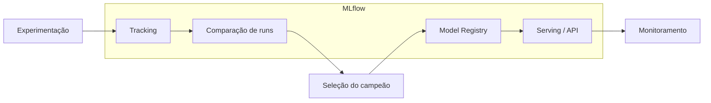

# MLFlow — Risco de Crédito

Estudo prático de **MLflow** aplicado a um pipeline de **classificação binária de risco de crédito**, acompanhando a evolução desde a **primeira run de tracking** até o **papel do MLflow dentro de um fluxo MLOps** completo: experimentação, seleção de modelos, registro, versionamento, serving e orquestração reproduzível.

Repositório: [github.com/Umbelito/MLFlow](https://github.com/Umbelito/MLFlow.git)

---

## Contexto do problema

O objetivo é prever se um cliente será **inadimplente** (`inadimplente = 1`) ou **adimplente** (`inadimplente = 0`) com base em variáveis financeiras e cadastrais. O dataset é **sintético**, gerado por regras de negócio simuladas em `gerar_base_credito()`.

| Variável | Tipo | Descrição |
|---|---|---|
| `idade` | numérica | Idade do solicitante |
| `renda_mensal` | numérica | Renda mensal em reais |
| `tempo_emprego_anos` | numérica | Tempo de emprego |
| `score_interno` | numérica | Score de crédito interno (300–900) |
| `valor_solicitado` | numérica | Valor do empréstimo solicitado |
| `num_parcelas` | numérica | Número de parcelas |
| `tipo_renda` | categórica | CLT, autônomo, servidor público, aposentado |
| `possui_restricao` | categórica | sim / não |
| **`inadimplente`** | **target** | 0 = adimplente, 1 = inadimplente |

**Métricas de negócio priorizadas:** ROC-AUC, recall e precision da classe inadimplente — com trade-off explícito entre capturar inadimplentes (recall) e evitar falsos positivos (precision).

---

## Estrutura do repositório

```
mlflow_risk_credit/
├── notebooks/
│   ├── pipeline_risk_aulas1-5.ipynb   # Tracking, autolog, comparação e seleção
│   └── pipeline_risk_aulas6-7.ipynb   # Registry, PyFunc, serving e Docker
├── src/
│   ├── prepare_data.py                # Geração e split dos dados
│   ├── train.py                       # Treino e registro do modelo
│   ├── evaluate.py                    # Avaliação com threshold configurável
│   ├── run_pipeline.py                # Orquestração do pipeline (Aula 9)
│   └── run_project.py                 # Execução via MLflow Projects
├── MLproject                          # Definição dos entry points
├── python_env.yaml                    # Ambiente Python do projeto
├── teste_request.py                   # Teste da API de inferência
├── data/processed/                    # Datasets gerados por execução
├── mlartifacts/                       # Artefatos do tracking server
├── mlflow_registry.db                 # Backend SQLite do MLflow Server
└── comparacao_runs_aula04.csv         # Ranking exportado das runs da Aula 4
```

---

## Modelos avaliados

Todos os modelos usam um pipeline scikit-learn com pré-processamento compartilhado:

- **Numéricas:** imputação pela mediana + `StandardScaler`
- **Categóricas:** imputação pela moda + `OneHotEncoder`

| Algoritmo | Identificador |
|---|---|
| Regressão Logística | `logistic_regression` |
| Árvore de Decisão | `decision_tree` |
| Random Forest | `random_forest` |

---

## Jornada do estudo: da primeira run ao MLOps

O projeto foi construído em etapas progressivas. Cada experimento adiciona uma camada de maturidade ao ciclo de vida do modelo.

### Aula 2 — Primeira run de tracking

- Configuração do **tracking URI** local (`/mlruns`) e do experimento `risco_credito_comparacao_modelos`.
- Treinamento do **baseline** (Regressão Logística) dentro de `mlflow.start_run()`.
- Registro manual de **parâmetros** (modelo, hiperparâmetros, tamanho do dataset) e **métricas** (ROC-AUC no teste, ROC-AUC em validação cruzada, precision/recall da inadimplência).
- Primeira inferência simulada para um novo perfil de cliente.

> Aqui nasce o conceito central do MLflow Tracking: cada experimento vira uma **run rastreável** com identidade (`run_id`), parâmetros e métricas.

### Aula 3 — Logging manual enriquecido

- Evolução do tracking com `log_artifact`, `log_text`, `log_dict` e **tags** (`course_lesson`, `tracking_type`, `run_purpose`).
- Geração de relatórios (classification report, matriz de confusão) salvos como artefatos.
- Comparação entre versões da mesma run (`aula03_lr_manual_v1` vs `v2`).

### Aula 4 — Autolog e comparação de modelos

- Uso de `mlflow.sklearn.autolog()` para capturar automaticamente parâmetros, métricas e modelo.
- Treino de **três algoritmos** na mesma base, com métricas de negócio logadas manualmente por cima do autolog.
- Consulta programática via `mlflow.search_runs()` com filtros por tag e métrica.
- Exportação do ranking para `comparacao_runs_aula04.csv`.

### Aula 5 — Organização de experimentos e seleção do campeão

- Padronização de **tags comuns** (`project`, `task`, `dataset_version`, `code_version`).
- Shortlist com filtros de qualidade mínima (`roc_auc_teste >= 0.85`, `recall_inadimplente >= 0.85`).
- **Score ponderado** para decisão entre champion e challengers:

  ```
  technical_score = 0.35·ROC-AUC + 0.25·recall + 0.15·precision + 0.15·F1 + 0.10·estabilidade
  final_score     = 0.75·technical + 0.15·interpretabilidade + 0.10·simplicidade operacional
  ```

- Documentação da decisão e preparação de metadados para o Model Registry.

### Aula 6 — Model Registry

- Subida do **MLflow Tracking Server** com backend SQLite e artefatos locais:

  ```bash
  mlflow server \
    --backend-store-uri sqlite:///mlflow_registry.db \
    --default-artifact-root ./mlartifacts \
    --host 127.0.0.1 \
    --port 5000
  ```

- Registro do modelo campeão em `risco_credito_classifier_pyfunc`.
- Transição de estágios: **Staging → Production** com aliases.
- Carregamento de versões específicas via URI `models:/<nome>@<alias>`.

### Aula 7 — Formato MLmodel e contrato PyFunc

- Inspeção da estrutura `MLmodel`, `conda.yaml`, `python_env.yaml` e `serving_input_example.json`.
- Criação de um **wrapper PyFunc customizado** (`CreditRiskPyfuncModel`) que:
  - valida colunas obrigatórias na entrada;
  - aceita `threshold` como parâmetro de inferência;
  - retorna probabilidade, classe prevista e limiar utilizado.
- Registro com `registered_model_name` e alias `serving_candidate`.

### Aula 8 — Serving e containerização

- **Serving local** do modelo registrado:

  ```powershell
  $env:MLFLOW_TRACKING_URI = "http://127.0.0.1:5000"
  $env:MODEL_URI = "models:/risco_credito_classifier_pyfunc@serving_candidate"
  mlflow models serve -m $env:MODEL_URI -p 5001 --env-manager local
  ```

- Inferência via REST em `POST /invocations` (testado em `teste_request.py`).
- Construção de imagem Docker com `mlflow models build-docker`.
- Validação de payloads inválidos (colunas ausentes retornam erro esperado).

### Aula 9 — MLflow Projects (pipeline reproduzível)

O pipeline foi modularizado em scripts e orquestrado via `MLproject`:

```
prepare → train → evaluate
```

| Entry point | Script | Responsabilidade |
|---|---|---|
| `prepare` | `src/prepare_data.py` | Gera dados, faz split estratificado, loga artefatos |
| `train` | `src/train.py` | Treina, avalia e registra o modelo |
| `evaluate` | `src/evaluate.py` | Carrega modelo por URI, avalia com threshold |
| `pipeline` | `src/run_pipeline.py` | Orquestra as três etapas em uma run pai |

Cada execução recebe um `pipeline_id` único (`aula09_<hash>`), garantindo rastreabilidade ponta a ponta no experimento `risco_credito/09_mlflow_projects`.

---

## Papel do MLflow no MLOps



| Pilar MLOps | Componente MLflow | Como aparece neste projeto |
|---|---|---|
| **Reprodutibilidade** | Tracking + Projects | Parâmetros, métricas, artefatos e `MLproject` com entry points versionados |
| **Experimentação** | Tracking UI + API | Comparação de 3 algoritmos, filtros e ranking por score |
| **Governança** | Model Registry | Estágios, versões, aliases (`serving_candidate`) |
| **Deploy** | Models + Serving | API REST `/invocations` e imagem Docker |
| **Contrato de dados** | Signatures + PyFunc | Validação de schema, threshold configurável na inferência |
| **Orquestração** | MLflow Projects | Pipeline `prepare → train → evaluate` com run pai e runs filhas |

O MLflow atua como **camada de controle** entre ciência de dados e operação: o que antes era um notebook isolado passa a ser um artefato versionado, auditável e servível em produção.

---

## Como executar

### 1. Ambiente

```bash
python -m venv .mlflow
# Windows
.mlflow\Scripts\activate
# Linux/macOS
source .mlflow/bin/activate

pip install mlflow pandas numpy scikit-learn matplotlib cloudpickle requests
```

As dependências declaradas no projeto estão em `python_env.yaml`.

### 2. Notebooks (Aulas 1–8)

```bash
jupyter notebook notebooks/pipeline_risk_aulas1-5.ipynb
jupyter notebook notebooks/pipeline_risk_aulas6-7.ipynb
```

### 3. Tracking Server (necessário a partir da Aula 6)

```bash
mlflow server \
  --backend-store-uri sqlite:///mlflow_registry.db \
  --default-artifact-root ./mlartifacts \
  --host 127.0.0.1 \
  --port 5000
```

Interface disponível em [http://127.0.0.1:5000](http://127.0.0.1:5000).

### 4. Pipeline via MLflow Projects (Aula 9)

Executar o pipeline completo:

```bash
mlflow run . -e pipeline \
  -P model_name=random_forest \
  -P n_samples=6000 \
  -P registered_model_name=risco_credito_project_model
```

Ou etapas individuais:

```bash
mlflow run . -e prepare -P pipeline_id=manual
mlflow run . -e train -P data_dir=data/processed/manual -P model_name=logistic_regression
mlflow run . -e evaluate -P model_uri=runs:/<run_id>/model -P data_dir=data/processed/manual
```

Alternativa via script Python (com tracking server ativo):

```bash
python src/run_project.py
```

### 5. Teste da API de inferência

Com o serving rodando na porta 5001:

```bash
python teste_request.py
```

---

## Experimentos e modelos registrados

| Experimento | Aula | Finalidade |
|---|---|---|
| `risco_credito_comparacao_modelos` | 2–5 | Baseline, autolog e seleção |
| `risco_credito/06_model_registry` | 6 | Registro do campeão |
| `risco_credito/07_mlflow_models` | 7 | Wrapper PyFunc customizado |
| `risco_credito/09_mlflow_projects` | 9 | Pipeline reproduzível |

| Modelo registrado | Uso |
|---|---|
| `risco_credito_classifier` | Modelo sklearn campeão (Aula 5–6) |
| `risco_credito_classifier_pyfunc` | Wrapper com contrato de API (Aulas 7–8) |
| `risco_credito_project_model` | Modelo do pipeline MLproject (Aula 9) |

---

## Arquivos ignorados pelo Git

O `.gitignore` exclui:

- `.env` e variantes (credenciais e variáveis de ambiente)
- `.mlflow/` (ambiente virtual local)

Bancos SQLite (`mlflow_registry.db`, `mlflow.db`) e artefatos (`mlartifacts/`, `data/processed/`) são gerados em runtime e não devem ser versionados em produção real — considere adicioná-los ao `.gitignore` conforme a necessidade do time.

---

## Referências

- [Documentação oficial do MLflow](https://mlflow.org/docs/latest/)
- [MLflow Model Registry](https://mlflow.org/docs/latest/model-registry.html)
- [MLflow Projects](https://mlflow.org/docs/latest/projects.html)
- [MLflow Models — Deploy](https://mlflow.org/docs/latest/models.html#deploy-mlflow-models)
